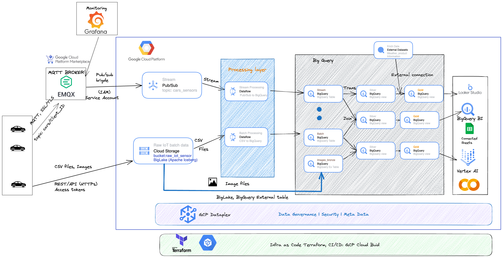

# GCP Architecture
Here is my GCP Architecture for the IoT project. In this project, all resource can be provided by using Terraform.

You can go watch my walk-through video in this YouTube link.




## Create pub/sub, dataflow, bigquery
Go to terraform_pub_sub
```
cd ./terraform_pub_sub
terraform init
terraform plan
terraform apply
```

This part will be create an emqx broker, after that you can download Grafana for monitoring the data in realtime.

## Create emqx

Go to terraform_emqx
```
cd ./terraform_emqx
terraform init
terraform plan
terraform apply
```

After that, we will create a emqx broker, go to gcp console, copy the 
 