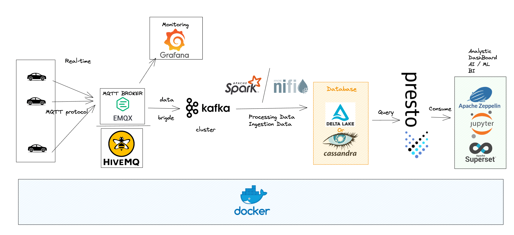

# Open-Source Project_iot_automobile
In this deployment, I will implement the project with the open-source tools.

Open-source data pipeline: 
1. EMQX MQTT Broker 
2. Apache Kafka
3. Apache NiFi
4. Spark
5. Apache Cassandra
6. Delta-lake
7. Apache Zeppelin

You can see the details of implementation of the datapipline in the sub-folder, it is include: `bash script file` or the `Docker compose file`

You can watch the demo of this project in this [link](https://youtu.be/sFgFQwlCxmk?t=1213)